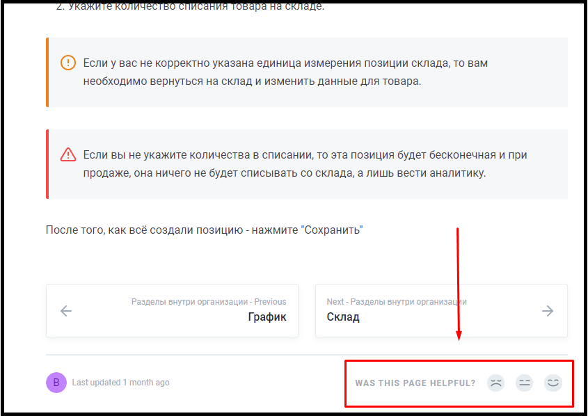

# Знакомство с Базой Знаний 2

**CRM - система (Customer Relationship Management)** - специализированная программа, которая автоматизирует бизнес-процессы, процедуры и операции, а также способствует развитию компании.

Минимизация человеческого фактора при работе с клиентами повышает прозрачность продаж, маркетинга и клиентского обслуживания.

**Цель:** цифровизация всех бизнес-процессов организаций с последующей автоматизацией их.

## Как работать с этой Базой Знаний?

Инструкция представлена на каждый раздел системы для вашего скорейшего знакомства с ними.

Как использовать:

* Поэтапно изучайте все разделы в левом меню, начиная с верха и до самого конца.
* Знакомьтесь с инструментами системы.
* Параллельно смотрите и заполняйте те же разделы в самой системе Data-CRM, чтобы закреплять материал.
* После изучения Базы Знаний и заполнения системы не откладывайте эту инструкцию в долгий ящик! Сохраните её в закладки с быстрым доступом, чтобы вы в любой момент могли быстро найти ответ на ваш вопрос.


Не забывайте пользоваться поиском в Базе Знаний, чтобы быстрее находить ответ на ваш вопрос! (Поисковая строка находится в правом верхнем углу)


## Оценка понятности представленного материала

В конце каждой страницы есть возможность рассказать Нам о понятности материала представленного в Базе Знаний Data-CRM. Опросник выглядит так:&#x20;

### **Метрика оценки материала:**

:disappointed: - эхх, сложно разобраться в материале.\
:expressionless: - окей, я смог всё настроить, но было тяжело.\
:blush: - вау, я разобрался и настроил всё без каких либо проблем.

**Расскажи нам свой опыт работы с Базой Знаний, позволь нам становится лучше!**\
****\
****Социальные сети и наши контакты, для тех, кто ничего не пропускает:\
INST: [@data\_crm](https://www.instagram.com/data\_crm/)\
Vk: [https://vk.com/hookahcrmru](https://vk.com/hookahcrmru)\
Tel: [https://t.me/hookahcrmofficial](https://t.me/hookahcrmofficial)\
FB: [https://www.facebook.com/HookahCRM/](https://www.facebook.com/HookahCRM/)\
\--------------------------------------------------------------\
Tel: +7(812)309-93-47\
Mail: info@data-crm.com\
Web: [data-crm.com](https://data-crm.com/)
