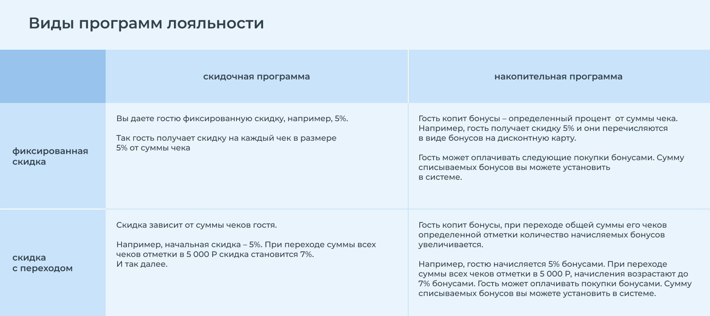

# Программы лояльности

## Создание программы лояльности

* Нажмите на кнопку "+".
* Введите название.
* Выберите тип программы лояльности: скидочная или накопительная.
* Выберите тип скидки: фиксированная или с переходами.
* Впишите количество бонусов при регистрации (если нужно).

Теперь настройка программы зависит от выбранных параметров.

### **1.  Скидочная программа с фиксированной скидкой**

Данный вид программы лояльности - это просто скидка.

* Тип программы: Скидочная.
* Тип скидки: Фиксированная.
* Укажите тип скидки.


Во вкладке "Список исключений" вы можете указать исключения, чтобы скидка не распространялась на некоторые позиции.&#x20;


### 2. Накопительная программа с фиксированной скидкой

Тип данной программы лояльности - это, размер накопления бонусов зависит от количества оставленных денег в вашем заведении.

* Тип программы: Накопительная.
* Тип скидки: С переходами.
* Создайте несколько переходов начиная от 0 р.
* Укажите от какой общей суммы оставленных денег в заведении предоставлять % от чека бонусов Гостю.


Во вкладке "Список исключений" вы можете указать исключения, чтобы накопление бонусов не распространялось на некоторые позиции.&#x20;


### 3. Скидочная программа и скидка с переходами

Такая же скидочная программа, но с встроенной геймификацией, которая втягивает Гостя получать скидку всё больше и больше. Скидочная программа но имеющая переходы от зависимости оставленных средств в заведении.


Геймификация - это процесс использования игрового мышления и динамики игр для вовлечения аудитории и удержания её.


* Тип программы: Скидочная.
* Тип скидки: С переходами.
* Создайте несколько переходов начиная от 0 р.
* Укажите от какой общей суммы оставленных денег в заведении предоставлять большую скидку Гостю.


Во вкладке "Список исключений" вы можете указать исключения, чтобы скидка не распространялась на некоторые позиции.&#x20;



Система сама ведёт кол-во оставленных денег в заведении, и автоматически ведёт Гостя на новый переход.


### 4. Накопительная программа и начисление бонусов с переходами

Такое же начисление бонусов от суммы чека, но с встроенной геймификацией, которая втягивает Гостя получать % всё больше и больше. Гость переходит каждый раз на новый уровень от количества оставленных денег у вас в заведении. Чем больше у вас потратил, тем больше получил.


Геймификация - это процесс использования игрового мышления и динамики игр для вовлечения аудитории и удержания её.


* Тип программы: Накопительная.
* Тип скидки: С переходами.
* Создайте несколько переходов начиная от 0 р.
* Укажите от какой общей суммы оставленных денег в заведении предоставлять % накопления от чека бонусов Гостю.

**При сумме от** - От какого количества оставленных средств в вашем заведении будет начисляться %.\
**Начисление %** - Процент начисления бонусов от суммы чека.\
**Макс. % оплаты чека бонусами** - Какой максимальный процент Гость может оплатить от чека бонусами.


Если Гостю присвоена программа лояльности Накопительная (CashBack) и он половину чека гасит балами, то начисляться баллы будут не от всего чека, а от той части, за которую он заплатит деньгами.


**Пример:**

Представим что у Гостя CashBack 10%\
Он посидел на сумму - 1.000 руб и погасил бонусами 500р.\
А оставшиеся 500 оплатил наличкой.\
\
**Начисляться будет с 500 рублей, то есть 50 баллов!**


Сотрудникам же ничего не нужно считать, их задача только при расчёте выбирать Гостя с программой лояльности, который будет платить.



**ВНИМАНИЕ!**\
При списании, бонусы всё равно копятся.

